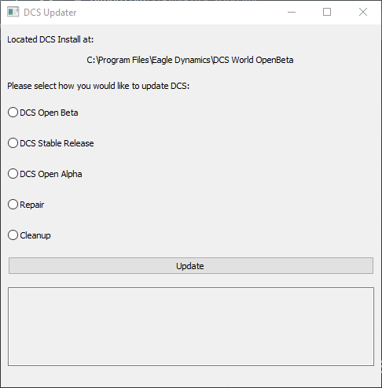

# DCS Updater

A simple updater for Digital Combat Simulator (DCS) World...

I always found it very cumbersome that I had to run weird command with the updater to just run an update for simple versions or swap to a different branch (like stable).

So I decided to create a simple UI interface to handle it all for you!

## Usage

Usage is very simple - run the program and it will automatically locate your install path via the Registry. You only need to select which branch of DCS you'd like to update to and the installer will run the appropriate `dcs_updater.exe` commands to check for updates for that branch!

The updater will launch as it normally would and once complete the updater will show either a `SUCCESS!` prompt, or an error code it received when attempting to launch your `dcs_updater.exe`.

## Future

I would like to enhance the app a bit by making the UI a little bit cleaner as well as adding the ability to install/uninstall different modules without having to launch the app.

Additionally I'd like to figure out a clean way to setup some integrated testing to ensure that everything is going to execute as expected...